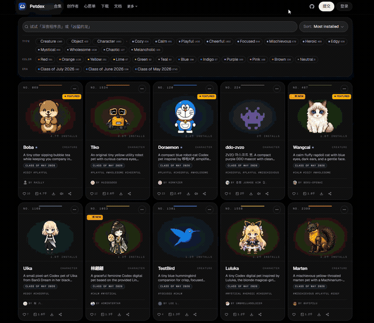
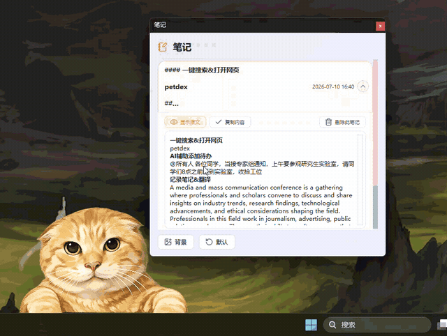
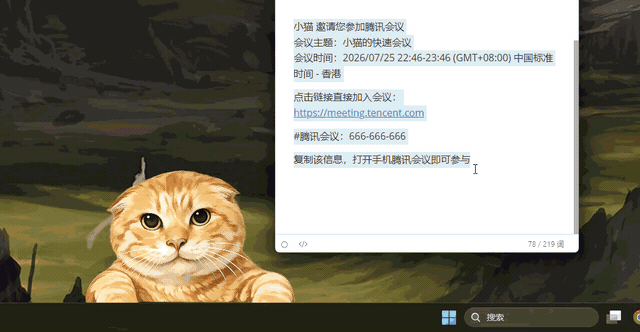
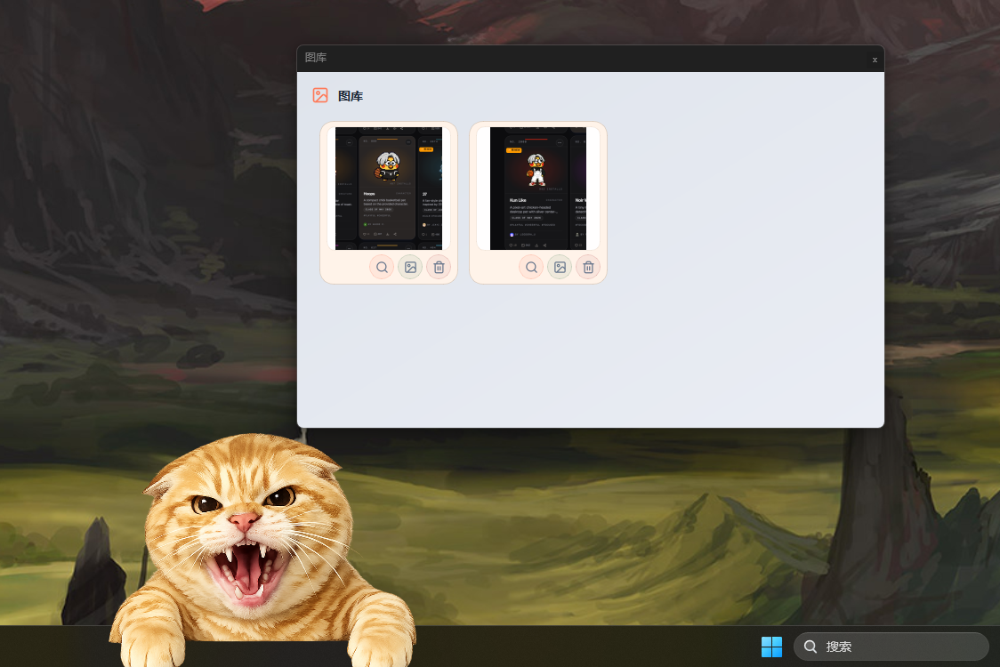
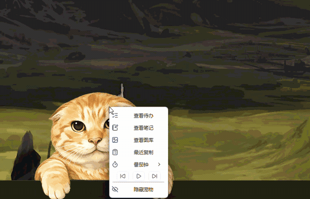
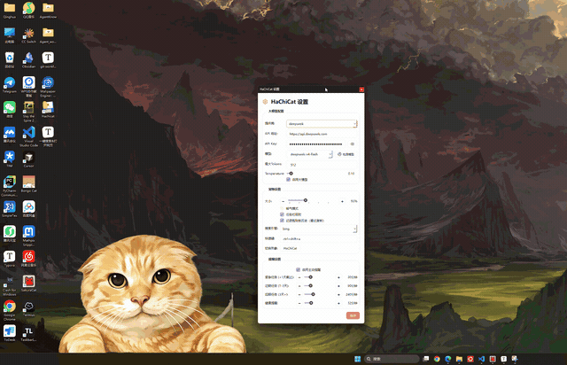

# 🐱 HaChiCat — 桌面宠物助手

桌面助手，使用快捷键一键添加待办/记录笔记/保存图片/翻译，释放文件传输助手压力

---

## ✨ 功能特性

### 桌面宠物
- 原生橘猫形象，就是性格不是很友好

  

- 支持Petdex形象导入，千万形象可选择

  


## ✨ 功能目标--释放文件传输助手压力，快捷管理粘贴板

复制文字/图片，按快捷键(默认快捷键Ctrl+Shift+Z，可修改)弹出浮动菜单：


### 文字
| 功能 | 说明 |
|------|------|
| 🔍 **搜索** | 浏览器搜索，支持 Bing/Google/百度等搜索引擎|
| 📝 **记笔记** | 保存文字，支持 Markdown 渲染预览 |
| 📋 **添加待办** | AI 自动提取待办，支持多条识别、智能时间解析 |
| 🌐 **翻译** | 英译中，单词词典格式（词性+多释义），句子流畅翻译 |

#### **笔记**

保存文本，支持markdown渲染：



#### **待办**

AI总结主题，截止时间，并在截止时间前提醒用户



#### 图片

- 按下快捷键将刚刚复制的图片展示在桌面，可展示多张图片，方便工作时快速对比，无需再保存到文件传输助手
- 可保存到图库，可再次复制，避免丢失




#### 最近复制

复制的太多？找不回想要的内容？

小猫这里可以保存



#### 番茄钟

右键宠物 → 番茄钟，可选 5 / 15 / 25 / 45 分钟。陪你（哈气）沉浸式（哈气）学习（哈~

#### 音乐控制

右键菜单内置上一首 / 播放暂停 / 下一首，控制系统当前播放的媒体。

#### 保护你的电脑

- 放在你不想让人打开的文件夹附近
- 设置中开启哈~气~模式，鼠标靠近小猫就会被推开（哈~不让摸）
- 也可以**变得很大**守护整个桌面（但是你也**别想用**了（哈~））




---

## 🚀 快速开始

### 直接下载（推荐）

前往 [Releases](https://github.com/sduwqh/HachiCat/releases) 下载最新版 `Hachicat_v1.3.zip`，解压后运行文件夹里的 `Hachicat_v1.3.exe` 即可，无需安装 Python。

> exe 依赖同目录的 `_internal` 文件夹，请保持文件夹结构完整，不要单独移动 exe。

### 从源码运行

#### 环境要求

- **Python 3.11+**
- **Windows 10/11**（使用了 Win32 API）

#### 安装运行

```bash
# 克隆项目
git clone https://github.com/sduwqh/HachiCat.git
cd HaChiCat

# 创建虚拟环境
python -m venv venv
venv\Scripts\activate

# 安装依赖
pip install -r requirements.txt

# 运行
python run.py
```

首次运行会自动创建 `data/` 目录和 SQLite 数据库。

---

## ⚙️ 配置 AI 功能

翻译、待办提取、提醒等需要大模型 API：

1. 注册 [DeepSeek](https://platform.deepseek.com) 获取 API Key；
2. 右键托盘图标 → 设置 → 填入 API Key
3. 点击「检测模型」自动拉取可用模型列表
4. 也可在设置中切换到其他提供商

不用 AI 的话，搜索、笔记、图库、音乐等功能完全不受影响。

---

## 🐾 安装 Petdex 形象

1. 设置 → 切换形象 → **+ 添加新形象**
2. 在 [petdex.dev](https://petdex.dev) 挑选喜欢的宠物
3. 点击 Copy Page Link 复制链接
4. 粘贴到输入框 → 自动下载安装 → 永久可用

---

## 📄 许可

MIT
